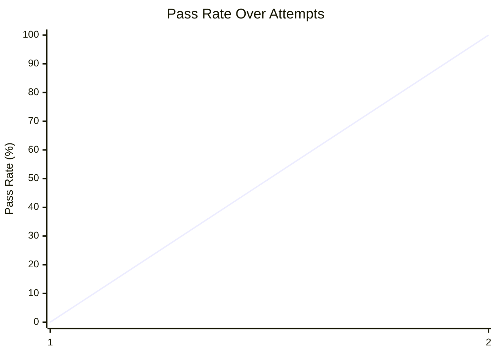

# Test Performance Report

All tests are passing after iterative implementation and dependency correction.

```mermaid
xychart-beta
    title "Pass Rate Over Attempts"
    x-axis [1, 2]
    y-axis "Pass Rate (%)" 0 --> 100
    line [0, 100]
```
